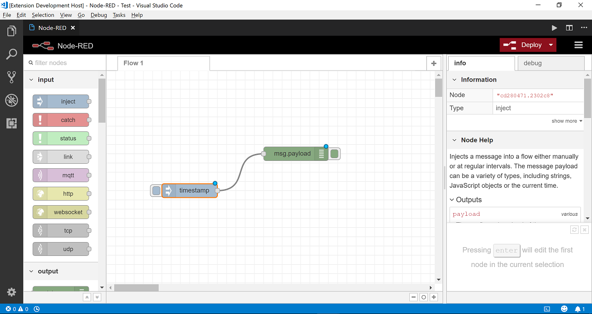

# Node-RED

Flow-based programming for the Internet of Things. Use Node-RED inside your VS Code. You could also connect to Node-RED on any IP-enabled device such as Raspberry Pi.

## Usage

To open Node-RED in VS Code:
  * use shortcut `Ctrl+Alt+X`
  * or press `F1`, then type `Node-RED: Open`



To open Node-RED to the side:
  * use shortcut `Ctrl+Alt+Y`
  * or press `F1`, then type `Node-RED: Open to the Side`

## Settings

* `vscode-node-red.url`: The url of Node-RED, e.g. `http://127.0.0.2:8008`. You could use this setting to connect to Node-RED on any IP-enabled device.
* `vscode-node-red.settings.js`: Configuration of Node-RED, refer to https://nodered.org/docs/configuration. e.g.
```json
"vscode-node-red.settings.js": {
        "editorTheme": {
            "projects": {
                "enabled": true
            }
        }
    }
```

## Limitation

Currently, when you switch between the editor tabs, the Node-RED editor will be reloaded due to [#16307](https://github.com/Microsoft/vscode/issues/16307). This issue would be resolved when the new VS Code [Webview API supports localStorage](https://github.com/Microsoft/vscode/issues/52246) .

## Change Log

See Change Log [here](CHANGELOG.md)

## Issues

Currently, the extension is in the very initial phase. If you find any bug or have any suggestion/feature request, please submit the [issues](https://github.com/formulahendry/vscode-node-red/issues) to the GitHub Repo.